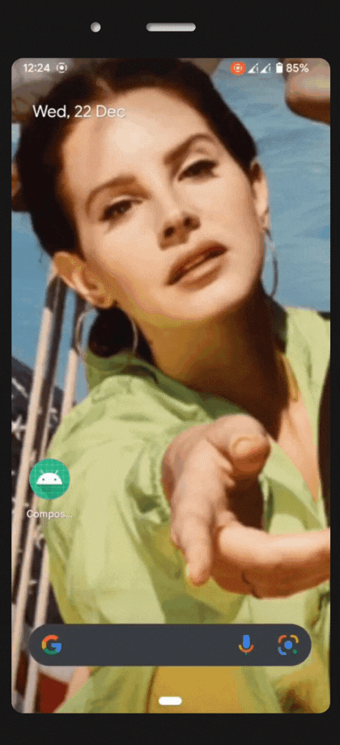
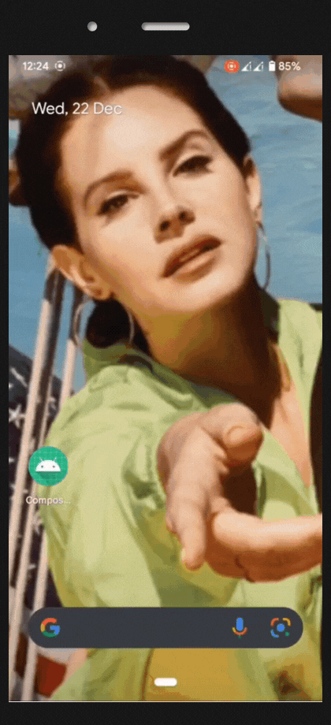
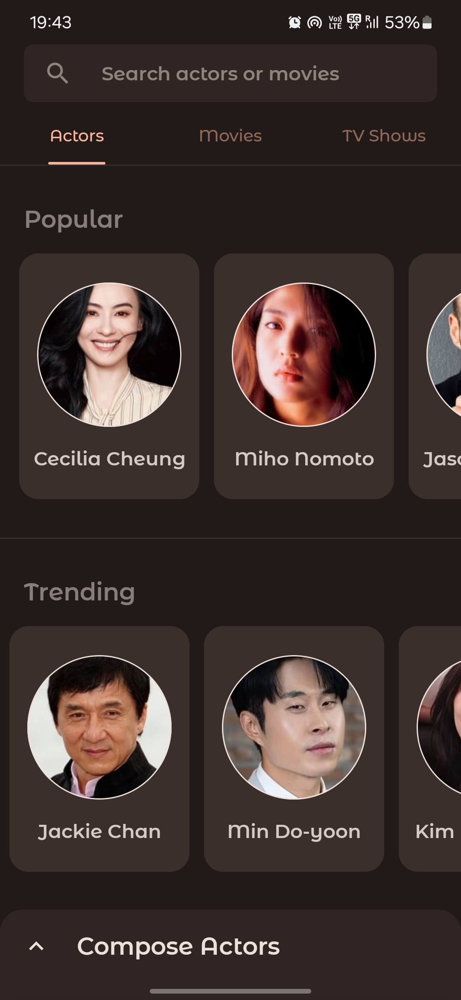
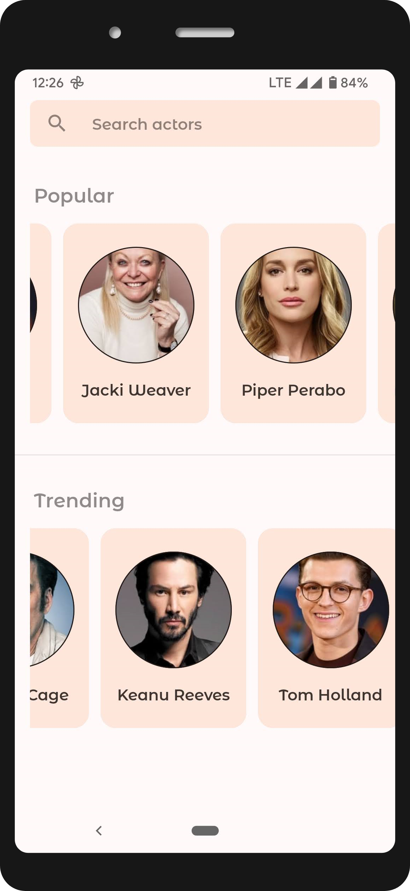
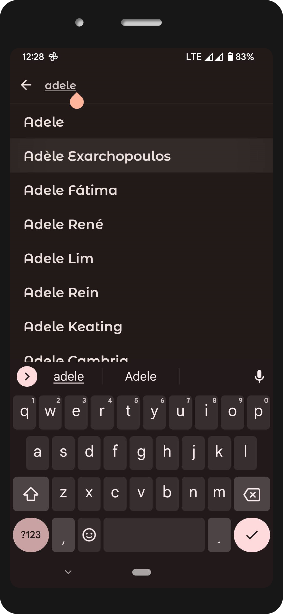
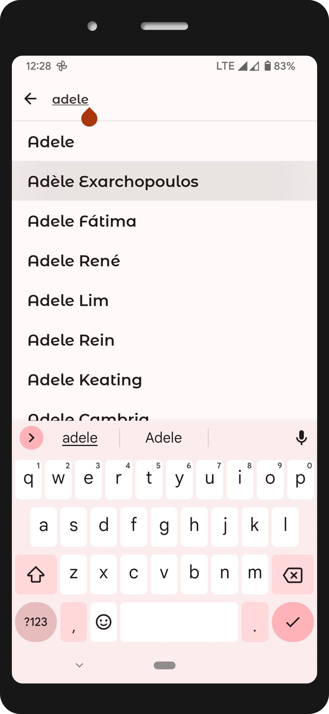
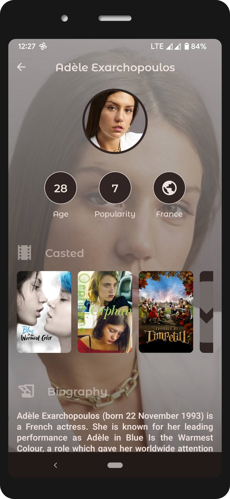
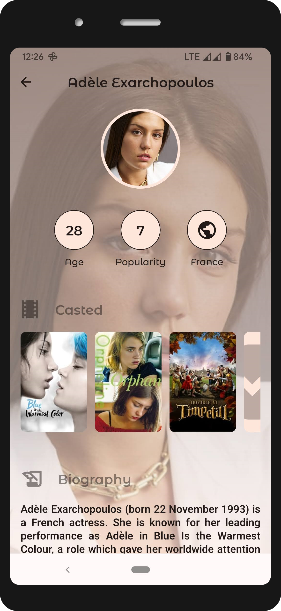

# Compose Actors :dancer:

## Roadmap v0.3.0

- [x] Let users search for movies directly just like searching for actors.
- [x] Hilt will be replaced by removing Koin.
- [x] Restructure packages and files by introducing new source files.
- [ ] ~Replace every Spacer composable used in code with various custom AppSpacer.~
- [x] Separate the ViewModel param from Screen and UI composables to see previews for all screens.
- [x] Break composables into smaller for previewing.
- [x] Separate composables into Screen and UI to separated ViewModel usage and previewing for all screens.
- [x] Add feature for adding actors to favorites like movies.
- [x] Add bottom sheet to home screen to support navigation for various screens.
- [x] Implement paging to upcoming lazy list movies in home tab.
- [x] Setup project dependencies, resources for initial testing, write simple test. 
- [ ] Write tests for app navigation for all composable destinations.

## Roadmap v0.4.0
### Rename app from Compose actors -> Compose Entertainer.

- [ ] Add new feature seasons or series information to app.
- [ ] Include seasons in home tabs navigation.
- [ ] Enabled adding seasons to favorites.
- [ ] Move favorites section from home tab to new place (Restructure all screen flows).
- [ ] Collapsable TopBars, BottomBars, Scroll effects, new animations.


### New release - v0.2.0

- [x] Add DI with Koin.
- [x] Modal bottom sheets & Bottom sheets.
- [x] Migrate to compose insets from accompanist.
- [x] Add new movie details screen, made changes to actors details screen.
- [x] Improved search functionality, added voice search, handled keyboard changes.
- [x] New feature to add Movie to favorites.
- [x] Add new database repository layer for favorites.
- [x] Add tabs in Home screen with actors/movies/favorites categories.

## V2 Previews

### Home Tabs

| Actors | Movies | Favorites |
| :----: | :----: | :-------: |
|  |  |  |

### Modal bottom sheets

| Actor | Movie |
| :---: | :---: |
|  |  |

### Movie details & Add to favorites

| Add to favorites | Favorites | Details |
| :--------------: | :-------: | :-----: |
|  |  |  |

### Voice search actors

| Search capabilities |
| :---: |
|  |

*Inspired from*
| [JetCaster](https://github.com/android/compose-samples/tree/main/Jetcaster) | [JetNews](https://github.com/android/compose-samples/tree/main/JetNews) | [JetSnack](https://github.com/android/compose-samples/tree/main/Jetsnack) |
| :-: | :-: | :-: |
> [More compose content](https://developersbreach.com/compose/)

## :tokyo_tower: Architecture

> ### Follows new architecture guide updated on [**14 December 2021**](https://android-developers.googleblog.com/2021/12/rebuilding-our-guide-to-app-architecture.html) from revamped guide to app architecture.

#### :musical_keyboard: Layer of this app.

| Network |  | Repository |  | ViewModels |  | Screens |
| :-:     | :-:     | :-:     | :-:    | :-:     | :-:     | :-:     |
| `Data`<br> :gift::gift:<br> :gift::gift: | **--->** | `Source`<br> :gift: | **--->**<br>`Suspend` | `Coroutines`<br> :curly_loop::curly_loop: | **--->**<br>`State` | `Composables`<br>:iphone::iphone:<br>:iphone::iphone: |


## :dango: App Overview  [Compose Blog](https://developersbreach.com/compose/)

Android app built with `Jetpack Compose` shows actors information fetched from Tmdb Api.
You may install and try to understand the code better, but make sure you provide your own Tmdb api
key for data to show up in directory `/utils/ApiKey.kt`.

### Release - v0.1.0

| Screen | Preview |
| :----- | :------:|
|  **Home Screen** _(Default destination)_<br><br> • Shows category list of actors in row of type _popular & trending_.<br> • Has it's own ViewModel to manage it's ui state.<br> • Custom TopAppBar container with search box.<br> • Navigates to Search screen clicking search box.<br> • Navigates to Detail screen with castId clicking any cast item.<br> • If user is offline snackbar message is shown.<br> • CircularProgressIndicator will be shown untill data is fetched.<br> • Image fetching with Coil, manages state error/placeholder. |  |
|        |                                                                              |
| **Search Screen**<br><br> • Shows list of actors based on user submitted query.<br> • Animatable shapes infinitely repeatable.<br> • Has it's own ViewModel to manage it's ui state.<br> • TextField contained in TopAppBar completely transparent.<br> • Navigates to Detail screen with castId clicking any cast item.<br> • Screen and animation state changes on search began.<br> • Handles query & value changes correctly to fetch results.<br> • Draw Arc/Line on canvas & animate to shape shift like search icon.<br> • Different colors for animatables for both light/dark theme. |  |
|        |                                                                                  |
| **Detail Screen**<br><br> • Shows user selected actor from other screens.<br> • Has it's own ViewModel to manage it's ui state.<br> • Reveal effect animation added to few composables.<br> • CircularProgressIndicator will be shown untill data is fetched.<br> • Image fetching with Coil, manages state error/placeholder.<br> • Background image with gradient foreground effect.<br> • Draws dynamic color behind system bars. |  |

## :mag: Search Animation

```kotlin
// Simple progressive circle looking animation
val animateCircle = remember { Animatable(0f) }.apply {
    AnimateShapeInfinitely(this)
}

@Composable
fun AnimateShapeInfinitely(
    // shape which will be animated infinitely.
    animateShape: Animatable<Float, AnimationVector1D>,
    // final float state to be animated.
    targetValue: Float = 1f,
    // duration took for animating once.
    durationMillis: Int = 1000
) {
    LaunchedEffect(animateShape) {
        animateShape.animateTo(
            targetValue = targetValue,
            animationSpec = infiniteRepeatable(
                animation = tween(durationMillis, LinearEasing),
                repeatMode = RepeatMode.Restart
            )
        )
    }
}
```

Although I couldn't fully achieve the desired result as I imagined, I've settled for this current
state for now.


Calling the function once will draw a circle, in my example I have drawn it thrice with differnt colors, radius and scales.

```kotlin
DrawCircleOnCanvas(
    scale = scaleInfiniteTransition(targetValue = 2f, durationMillis = 600),
    color = circleColor,
    radiusRatio = 4f
)
```

I have kept all initial states of 3 circles to 0f to make end result much smoother.<br>
Random or uneven gaps between initial/target/durationMillis will make end animation look more abrupt and aggressively pushing it's bounds.

```kotlin
@Composable
private fun scaleInfiniteTransition(
    initialValue: Float = 0f,
    targetValue: Float,
    durationMillis: Int,
): Float {
    val infiniteTransition = rememberInfiniteTransition()
    val scale: Float by infiniteTransition.animateFloat(
        initialValue = initialValue,
        targetValue = targetValue,
        animationSpec = infiniteRepeatable(
            animation = tween(durationMillis, easing = LinearEasing),
            repeatMode = RepeatMode.Reverse
        )
    )
    return scale
}
```

```kotlin
@Composable
fun DrawCircleOnCanvas(
    scale: Float,
    color: Color,
    radiusRatio: Float
) {
    Canvas(
        modifier = Modifier
            .fillMaxSize()
            .graphicsLayer {
                scaleX = scale
                scaleY = scale
            }
    ) {
        val canvasWidth = size.width
        val canvasHeight = size.height
        drawCircle(
            color = color,
            center = Offset(
                x = canvasWidth / 2,
                y = canvasHeight / 2
            ),
            radius = size.minDimension / radiusRatio,
        )
    }
}
```

## :mobile_phone_off: Offline state

| Dark | Light |
| :--: | :---: |
|  |  |

Show a Snackbar message with `SnackbarHostState`.

```kotlin
if (!isOnline) {
    LaunchedEffect(scope) {
        scope.launch {
            scaffoldState.snackbarHostState.showSnackbar(
                message = context.getString(R.string.offline_snackbar_message),
                duration = SnackbarDuration.Indefinite
            )
        }
    }
}
```

### ViewModels

All screens have their own ViewModels for managing the ui state.

```kotlin
class HomeViewModel(
    application: Application,
    private val repository: AppRepository
) : AndroidViewModel(application) {

    // Holds the state for values in HomeViewState
    var uiState by mutableStateOf(HomeViewState())
        private set

    init {
        // Update the values in uiState from all data sources.
        viewModelScope.launch {
            uiState = HomeViewState(isFetchingActors = true)
            val popularActorsList = repository.getPopularActorsData()
            val trendingActorsList = repository.getTrendingActorsData()
            uiState = HomeViewState(
                popularActorList = popularActorsList,
                trendingActorList = trendingActorsList,
                isFetchingActors = false
            )
        }
    }
}
```

Model for UI state of the screen.

```kotlin
data class HomeViewState(
    var popularActorList: List<Actor> = emptyList(),
    var trendingActorList: List<Actor> = emptyList(),
    val isFetchingActors: Boolean = false,
)
```

ViewModel used in a screen-level composable.

```kotlin
@Composable
fun HomeScreen(
    viewModel: HomeViewModel
) {
    val uiState = viewModel.uiState
    Box {
        ScreenContent(uiState.popularActorList)
    }
}
```

### Repository

All ViewModels have access to repository which has single instance.

```kotlin
class AppRepository {

    private val networkDataSource by lazy { NetworkDataSource() }

    suspend fun getPopularActorsData(): List<Actor> {
        val listData: List<Actor>
        withContext(Dispatchers.IO) {
            listData = networkDataSource.getPopularActors()
        }
        return listData
    }
}
```

Instantiated repository will be passed to all ViewModels.

```kotlin
val repository = (application as ComposeActorsApp).repository

NavHost(
    navController = navController,
    startDestination = startDestination
) {
    composable(
        "Destination Route"
    ) {
        HomeScreen(
            viewModel = viewModel(
                factory = HomeViewModel.provideFactory(
                    application, repository
                )
            )
        )
    }
}
```

## :hammer: Structure

| :file_folder: data | :file_folder: navigation | :file_folder: repository | :file_folder: root |
| :-|:-|:-|:- |
| :page_facing_up: NetworkDataSource.kt<br> :page_facing_up: JsonRemoteData.kt<br> :page_facing_up: Urls.kt | :page_facing_up: AppActions.kt<br> :page_facing_up: AppDestinations.kt<br> :page_facing_up: AppNavigation.kt | :page_facing_up: AppRepository.kt | :page_facing_up: MainActivity.kt<br> :page_facing_up: Application.kt |
| :file_folder: ui | :file_folder: utils | :file_folder: model |
| :file_folder: home<br> :file_folder: details<br> :file_folder: search<br> :file_folder: components<br> :file_folder: theme | :page_facing_up: InfiniteFlowingThings.kt<br> :page_facing_up: RevealEffect.kt<br> :page_facing_up: Utilities.kt<br> :page_facing_up: DynamicThemeGenerator.kt<br> :page_facing_up: NetworkManager.kt<br> :page_facing_up: NetworkQueryUtils.kt | :page_facing_up: Actor.kt<br> :page_facing_up: ActorDetail.kt<br> :page_facing_up: Movie.kt |

### :file_folder: Packages in ui

| :file_folder: home | :file_folder: details | :file_folder: search | :file_folder: components | :file_folder: theme |
| :-|:-|:-|:-|:- |
| :page_facing_up: HomeScreen.kt<br> :page_facing_up: HomeViewModel.kt<br> | :page_facing_up: DetailsScreen.kt<br> :page_facing_up: DetailsViewModel.kt | :page_facing_up: SearchScreen.kt<br> :page_facing_up: SearchViewModel.kt<br> :page_facing_up: AnimatedSearch.kt | :page_facing_up: AppBars.kt<br> :page_facing_up: Components.kt<br> :page_facing_up: NetworkImage.kt<br> :page_facing_up: Progress.kt | :page_facing_up: Color.kt<br> :page_facing_up: Shape.kt<br> :page_facing_up: Theme.kt<br> :page_facing_up: Type.kt |

## :cyclone: Image loading with Coil

Reusable composable used in all screens to load image from an Url.

```kotlin
@Composable
fun LoadNetworkImage(
    imageUrl: String,
    contentDescription: String,
    modifier: Modifier,
    shape: Shape
) {
    Image(
        painter = rememberImagePainter(
            data = imageUrl,
            builder = {
                placeholder(R.drawable.animated_progress)
                error(R.drawable.ic_image_not_available)
            }),
        contentDescription = contentDescription,
        contentScale = ContentScale.Crop,
        modifier = modifier
            .clip(shape)
            .background(color = MaterialTheme.colors.surface)
    )
}
```

Then we will just call the composable anywhere in app screens.

```kotlin
LoadNetworkImage(
    imageUrl = "https://image_url",
    contentDescription = stringResource(R.string.cd_movie_poster),
    modifier = Modifier.size(100.dp, 150.dp),
    shape = MaterialTheme.shapes.medium,
)
```

## :art: App Theme

### :rainbow: Material Design 3.
Followed theming and color practices from Material Theme Builder Web Tool.
Learn more [here](https://material-foundation.github.io/material-theme-builder/)

### Color.kt

```kotlin
// Light theme colors
val light_primary = Color(0xFFaa370c)
val light_onPrimary = Color(0xFFffffff)
val light_background = Color(0xFFFFFAF9)
val light_onBackground = Color(0xFF211a18)
val light_surface = Color(0xFFFFE6DB)
val light_onSurface = Color(0xFF211a18)

// Dark theme colors
val dark_primary = Color(0xFFffb59c)
val dark_onPrimary = Color(0xFF5f1600)
val dark_background = Color(0xFF211a18)
val dark_onBackground = Color(0xFFede0dc)
val dark_surface = Color(0xFF302522)
val dark_onSurface = Color(0xFFede0dc)
```

### Theme.kt

```kotlin
val LightColorPalette = lightColors(
    primary = light_primary,
    onPrimary = light_onPrimary,
    background = light_background,
    onBackground = light_onBackground,
    surface = light_surface,
    onSurface = light_onSurface,
)

val DarkColorPalette = darkColors(
    primary = dark_primary,
    onPrimary = dark_onPrimary,
    background = dark_background,
    onBackground = dark_onBackground,
    surface = dark_surface,
    onSurface = dark_onSurface
)
```

### :white_circle::black_circle: Light/Dark theme screenshots

| Home | Search | Detail |
| :--: | :----: | :----: |
|  <br>  |  <br>  |  <br>  |

## :pencil: Blog

|  |
| :-: |
| **Reveal effect animations in compose jetpack android** |
| [*Read article*](https://developersbreach.com/reveal-effect-animations-compose-android/) |

|  |
| :-: |
| **Compose and build android app with new architecture principles** |
| [*Read article*](https://developersbreach.com/compose-android-app-architecture/) |

|  |
| :-: |
| **Custom shape animations pulsating circles on canvas in compose android** |
| [*Read article*](https://developersbreach.com/custom-shape-animations-pulsating-circles-canvas-compose/) |

|  |
| :-: |
| **Search with TextField in list Compose Android Jetpack** |
| [*Read article*](https://developersbreach.com/search-with-textfield-list-compose/) |


## :bulb: Motivation and Context

`Jetpack Compose` is Android’s modern toolkit for building native UI. It enables you to quickly
bring your app to life with less code, powerful tools, and intuitive Kotlin APIs.

Understanding to implement own `Theme` `Shape` `Typography` `Color` has became bit easier by
referring to lot of official jetpack compose samples which are available in GitHub.

Best of all we got to do this in `Kotlin` way. Excited and long way to go from here.

## :trophy: Credits

### :rocket: JetCaster

Check the official [JetCaster](https://github.com/android/compose-samples/tree/main/Jetcaster) example from Android Team, I have used their code to generate Swatch with Palette Api in my Detail screen.

### :key: Tmdb Api

Images and all information in app belongs to and taken from [Tmdb Api](https://developers.themoviedb.org/3).
I do not own any of it and only made use of it for this app demonstration purpose.

Obtain your own Tmdb Api Key
from [here](https://www.themoviedb.org/settings/api)

## License

```
Copyright 2021 Rajasekhar K E

Licensed under the Apache License, Version 2.0 (the "License");
you may not use this file except in compliance with the License.
You may obtain a copy of the License at

    https://www.apache.org/licenses/LICENSE-2.0

Unless required by applicable law or agreed to in writing, software
distributed under the License is distributed on an "AS IS" BASIS,
WITHOUT WARRANTIES OR CONDITIONS OF ANY KIND, either express or implied.
See the License for the specific language governing permissions and
limitations under the License.
```
