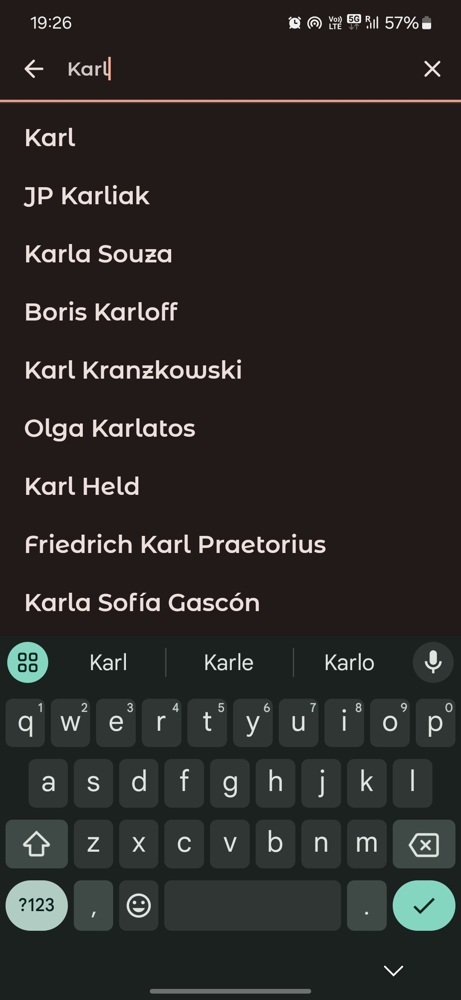
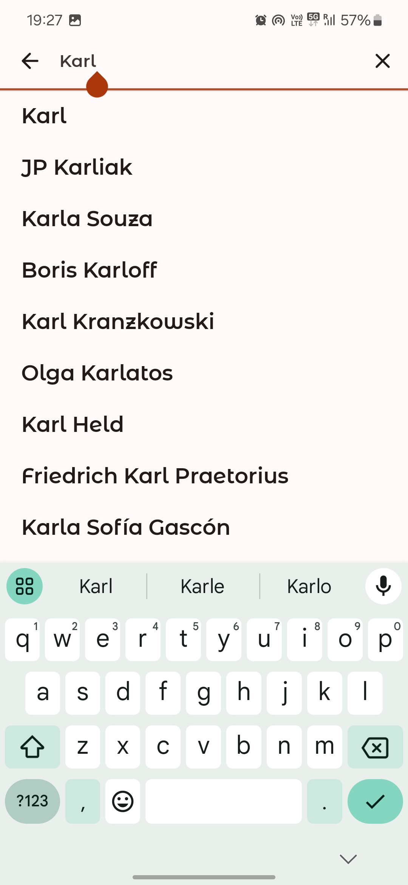

# Compose Actors :dancer:


## :scroll: Description

Android app built with `Jetpack Compose` shows actors information fetched from Tmdb Api.

| Home Screen |
|:--------------:|
|             |
| Search Screen |
|              |
| Detail Screen |
|              |
| Offline State |
|              |

### :dango: App Overview

| Screen | Preview |
|:-----|---------|
| Home |  |
| | |
| Search |  |
| | |
| Detail |  |
| | |
| Offline State |  |

You may install and try to understand the code better, but make sure you provide your own Tmdb api
key for data to show up.

You should add your missing api key in directory `/utils/ApiKey.kt`. Obtain your own Tmdb Api Key
from [here](https://www.themoviedb.org/settings/api)

## :pencil: Blog

## :bulb: Motivation and Context

`Jetpack Compose` is Android’s modern toolkit for building native UI. It enables you to quickly
bring your app to life with less code, powerful tools, and intuitive Kotlin APIs.

Understanding to implement own `Theme` `Shape` `Typography` `Color` has became bit easier by
referring to lot of official jetpack compose samples which are available in GitHub.

Best of all we got to do this in `Kotlin` way. Excited and long way to go from here.

## :camera_flash: Screenshots

### Dark Theme

<!-- &emsp;  -->

### Light Theme

<!-- &emsp; -->

## Images and Content

<!-- Cat and images belongs to and taken from [Fandom](https://www.fandom.com/) . I do not own the
images.  -->

## License

```
Copyright 2021 Rajasekhar K E

Licensed under the Apache License, Version 2.0 (the "License");
you may not use this file except in compliance with the License.
You may obtain a copy of the License at

    https://www.apache.org/licenses/LICENSE-2.0

Unless required by applicable law or agreed to in writing, software
distributed under the License is distributed on an "AS IS" BASIS,
WITHOUT WARRANTIES OR CONDITIONS OF ANY KIND, either express or implied.
See the License for the specific language governing permissions and
limitations under the License.
```
